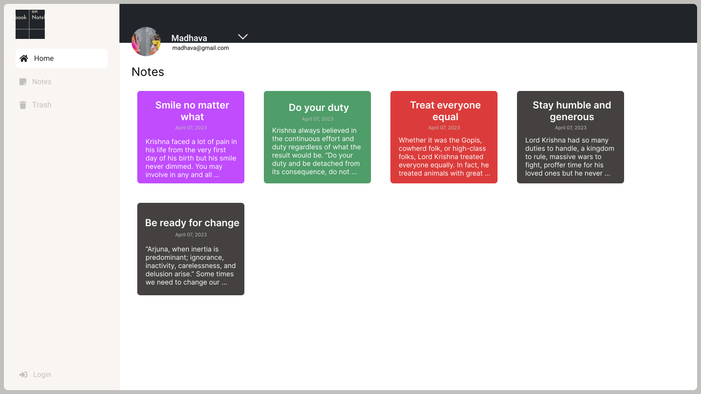

## This is a web application through which you can save your notes on the cloud and can access it on any device at anywhere using the internet.
## -> It is built using React Js framework and styled with the help of 'Bootstrap' a CSS framework.
## -> You can use it by simply creating an account there and it is totally free.
## -> Here is is the url: https://on-notebook.netlify.app/ 
## -> Thank you for giving some precious time to it ❤.
# onNotebook - Cloud-Based Note-Taking Web App

## Overview

onNotebook is a web application that allows you to save and access your notes on the cloud from anywhere using the internet. Built with the React.js framework and styled with Bootstrap, this app provides an efficient and user-friendly way to manage your notes.

## Features

- **Cloud-Based Notes**: Save your notes on the cloud, ensuring accessibility from any device with an internet connection.
- **User-Friendly Interface**: Enjoy an intuitive and easy-to-navigate user interface.
- **Note Creation and Editing**: Create, edit, and manage your notes with ease.
- **Responsive Design**: Access your notes on a desktop, tablet, or mobile device.
- **Secure Storage**: Your notes are securely stored on the cloud.
- **Trash**: Recover your deleted notes from trash. Notes will be deleted from the trash permanently after 60 days.
- **Customization**: Personalize your notes with styling options.

## Technologies Used

- **React.js**: The web app is developed using the React.js framework.
- **Bootstrap**: Bootstrap is used for styling and ensuring a responsive design.
- **Cloud Storage**: Notes are stored on the cloud for accessibility.

## Live Site

[Store your note](https://on-notebook.netlify.app/)

## Usage

1. Sign in to your account or create a new one.
2. Create, edit, and manage your notes in a user-friendly environment.
3. Your notes are saved on the cloud and can be accessed from any device with an internet connection.